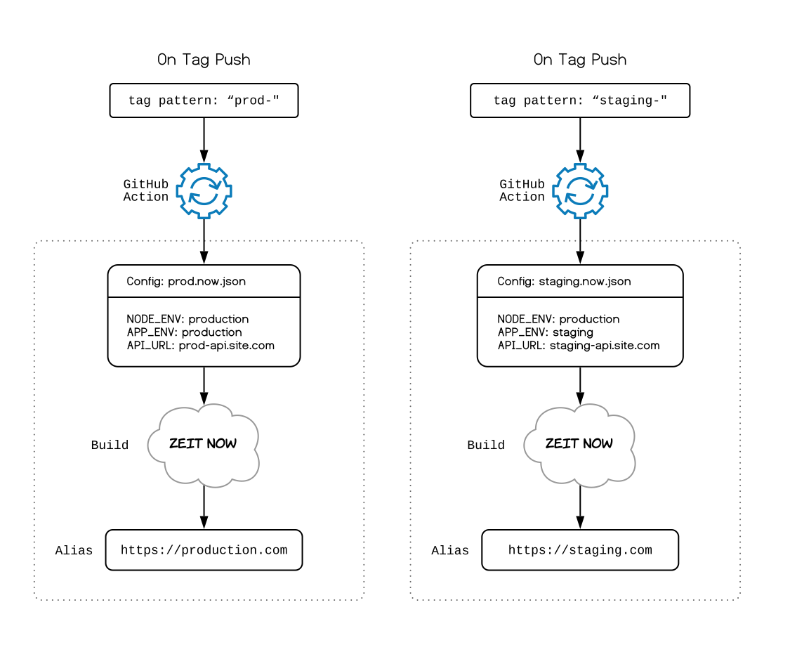

# nuxt-express-now

> Github Automated Nuxt + Express + Now deployments

## Diagram



## About this project

This is a sample Nuxt project that demonstrates setting up various environments and deploying to those environments automatically via Github Actions.

The project:

- Uses latest stable version of Nuxt and Express (currently Nuxt 2.9.2)
- Uses API endpoint from the ENV file (or from Now.json files)
- Uses Github actions to deploy when a tag with a specific pattern is pushed
- Uses ES6 in Node server code
- Uses basic auth that is conditionally enabled / disabled via env variable
- Automatically trims old deployments (that are not aliased) once a week

## Build Setup

``` bash
# install dependencies
$ yarn install

# serve with hot reload at localhost:3000
$ yarn dev

# build for production and launch server
$ yarn build
$ yarn start

# generate static project
$ yarn generate
```
